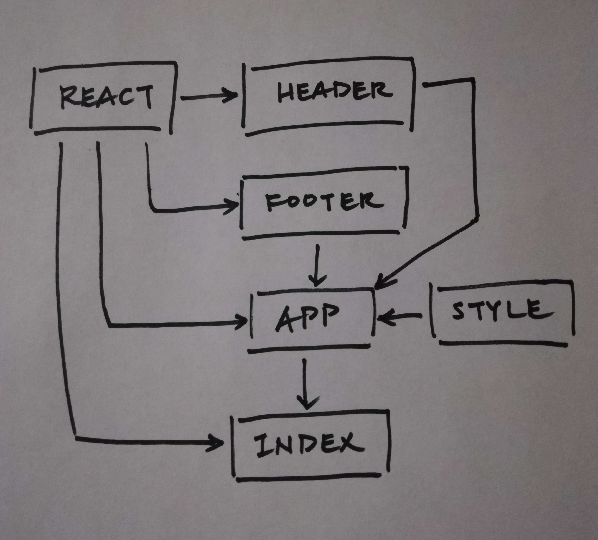

 LAB 26
=================================================

## Component Based UI

### Author: Katherine Smith

### Links and Resources
* [Sandbox](https://codesandbox.io/s/4jrp09z0x9)

### Modules

#### `App.js`
##### Contains the Counter React component
##### Contains and exports the App React component

##### Counter component

- ##### Implements event listeners to increment and decrement the count on click. Implements a render() method to display the count and counter buttons.

##### App component
- ##### Implements a render() method to display the header, counter, and footer. The header, counter, and footer are grouped together using a fragment.

#### `Header.js`
##### Contains and exports the Header React component

##### Header component
- ##### Implements a render() method to display the header.

#### `Footer.js`
##### Contains and exports the Footer React component

##### Footer component
- ##### Implements a render() method to display the footer.

#### UML

